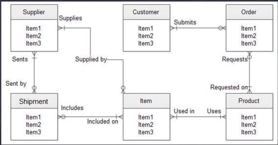
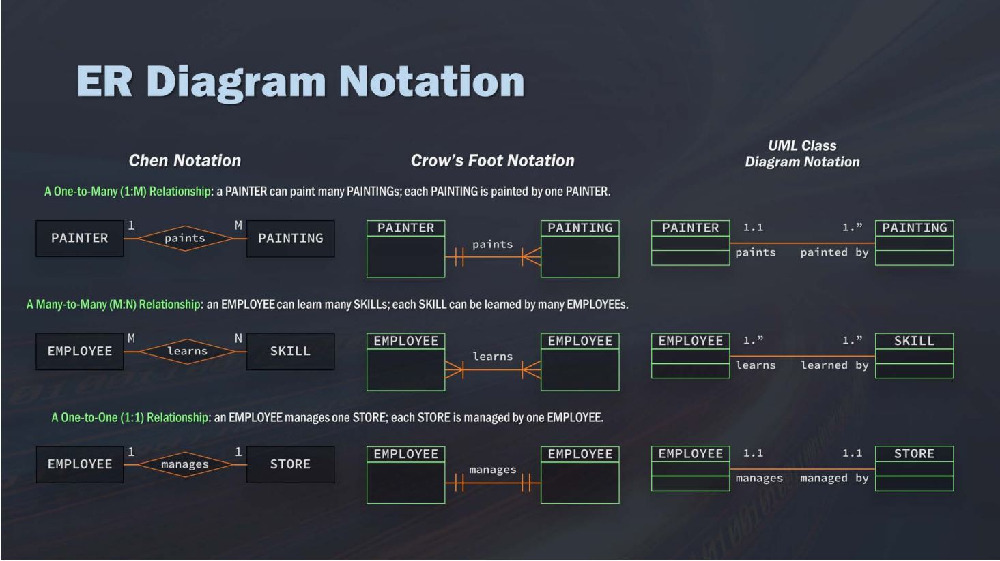

- [Overview](#overview)
  - [What is SQL](#what-is-sql)
  - [Relational database vs Transactional database](#relational-database-vs-transactional-database)
- [Data model building blocks](#data-model-building-blocks)
  - [Primary key and Foreign key](#primary-key-and-foreign-key)
- [ER Diagram](#er-diagram)
- [Comment](#comment)
- [Retrieve data](#retrieve-data)
- [Tables](#tables)
  - [Create new table](#create-new-table)
  - [Add data into the table](#add-data-into-the-table)
  - [Delete table](#delete-table)
  - [Truncate table](#truncate-table)
  - [Alter table](#alter-table)
  - [Permission](#permission)
  - [Temporary table](#temporary-table)
- [Data manipulation](#data-manipulation)
  - [Filtering](#filtering)
    - [Operation](#operation)
    - [Wildcard](#wildcard)
  - [Sorting](#sorting)
  - [Math operations](#math-operations)
  - [Aggregate Function](#aggregate-function)
  - [Grouping data](#grouping-data)
- [Subqueries](#subqueries)
- [Join](#join)
  - [Cartesian (Cross) Join](#cartesian-cross-join)
  - [Inner Join](#inner-join)
# Overview
## What is SQL
- SQL (Structured Query Language): A standard language for relational database
- A non-procedural language -> Won't be able to write application with it
- Usage:
  - Read/retrieve data
  - Write data: Add data to a table
  - Update data: Insert new data
## Relational database vs Transactional database

| <center> Relational             | <center> Transaction |
--------------------------------|---------------------
| Show relatinship between tables | More like operational database |
| Optimize for query -> Easier to access data | Good for reading and writting rows quickly |

# Data model building blocks

| <center> Entity | <center> Attribute | <center> Relationship |
-------|-----------|-------------
|Person, place, event, ... that are unique and distinguishable | Characteristic of an entity | Relation between entities <ul><li>One-to-many (Eg: 1 costumers have many invoices)</li>  <li>Many-to-many (Eg: Many students to many classes: 1 student can belong to many classes, and 1 class can have many students)</li> <li>One-to-one (Eg: Each store has 1 manager)</li></ul>|

## Primary key and Foreign key
- Primary key: A column (set of columns) whose values uniquely identify every row in the tables
- Foreign key: One or more columns to identify a row in another table    
# ER Diagram
<big> Show entities and relationship between them



# Comment
<big> Single line comment: 2 dashes
<small>
``` SQL
SELECT prod_name,
     --prod_id,
       prod_price
FROM Products;
```
<big> Multi-line commnent
<small>
``` SQL
SELECT prod_name,
    /* prod_id,
       prod_price
    */
FROM Products;
```

# Retrieve data
- SELECT statement has 2 components: What you want and where you want to select it from
- Retrieve data about product from a table named Products
``` SQL
SELECT prod_name,
       prod_id,
       prod_price
FROM Products;
```
- Get all the columns in table Products
``` SQL
SELECT *
FROM Products;
```
- Get first 5 rows from table Products
``` SQL
SELECT prod_name
FROM Products
LIMIT 5;
```

# Tables
## Create new table
- Specify what data type can be accepted (Eg: NULL -> Accept NULL value)
``` SQL
CREATE TABLE Shoes
    (
    Id          char(10)        PRIMARY KEY,
    Brand       char(10)        NOT NULL,
    Color       char(250)       NOT NULL,
    Price       decimal(8,2)    NOT NULL,
    Descript    Varchar(750)    NULL
    );
```
## Add data into the table
``` SQL
INSERT INTO Shoes
       (
        Id,
        Brand,
        Color,
        Price,
        Descript
       )
VALUES ('892071',
        'Gucci',
        'Pink',
        '695.00',
        NULL
       );
```

## Delete table
``` SQL
DROP TABLE Shoes;
```

## Truncate table
Clear all the data in the table
``` SQL
TRUNCATE TABLE Shoes;
```

## Alter table
Edit an existing table like adding columns, rename, ...
``` SQL
ALTER TABLE Shoes RENAME TO products;
```

## Permission
``` SQL
-- Grant permission
GRANT ALL PRIVILEGES ON Shoes TO authorized_users;
-- Remove access
REVOKE ALL PRIVILEGES ON Shoes TO authorized_users;
```

## Temporary table
- Temporary table will be deleted when current session terminate
- Benefit of temporary table
  - Faster than creating a real table
  - Useful for complex queries using subset of tables and joins   

Create a temporary table from a subset of another table
``` SQL
CREATE TEMPORARY TABLE Sandals AS
    (
        SELECT *
        FROM shoes
        WHERE shoe_type = 'sandals'
    )
```
# Data manipulation
## Filtering
- `WHERE`: Filters rows
``` SQL
SELECT column_name
FROM table_name
WHERE column_name operator value;
```
### Operation
| Operator | Description | 
| ---------|------------ |
| =        | Equal |
| <> or !=| Not equal |
| > | Greater than |
| < | Smaller than |
| >= | Greater than or equal |
| <= | Smaller than or equal |
| `BETWEEN` | An inclusive range |
| `IS NULL` | A NULL value |
| `IN` | Look for specific values |
| `OR` | A or B |
| `AND` | A and B |
> `IN` vs `OR`
> - `IN` can list more options   
> - `IN` execute faster than `OR`   
> - Can use another `SELECT` statment for subqueries using `IN`
``` SQL
SELECT ProductName,
       Price,
       SupplierID
FROM Products
WHERE ProductName = 'Tofu';

SELECT ProductName,
       Price,
       SupplierID
FROM Products
WHERE Price BETWEEN 75 AND 100;

SELECT ProductName,
       Price,
       SupplierID
FROM Products
WHERE SupplierID IN (1, 10, 12);

SELECT ProductName,
       Price,
       SupplierID
FROM Products
WHERE ProductName = 'Tofu' OR 'Konbu';

SELECT ProductName,
       Price,
       SupplierID
FROM Products
WHERE (SupplierID = 9 OR 11)
AND Price < 100;
```

### Wildcard
- Wildcard: Special character to match parts of a value   
- `LIKE` operator: Only use for string, cannot use with non-text datatype

| Wildcard `%` | Action |
|----------|--------|
| `%word` | Grab anything ending with *word* |
| `word%` | Grab anything starting with *word* |
| `%word%` | Grab anything before and after *word*|
| `t%@gmail.com` | Grabs all the email that start with *t* |
> `%` wildcard will not match NULL values

``` SQL
SELECT column_name 
FROM table_name
WHERE column_name LIKE '%word';
```

| Wildcard `_` | Action |
|----------|--------|
| `_word` | Grab 1 character before *word* |
| `word_` | Grab 1 character after *word* |
| `_word_` | Grab 1 character before and after *word*|

> - Wildcard takes longer to run than using operators like `>, <, =`    
> - Wildcards are different depending on the database management system using

## Sorting
- `ORDER BY` operation
  - Takes 1 or more columns (Add comma if more than 1 columns)
  - Can sort by a column not retrieved
  - Must be the last clause in a `SELECT` statment
- Sort direction:
  - `DESC`: Descending order
  - `ASC`: Ascending order
``` SQL
SELECT product_name
FROM Products
ORDER BY Price ASC;
```

## Math operations
| Operation | Description |
|-----------|-------------|
|+| Addition |
|-| Subtraction |
|*| Multiplication |
|/| Division |

``` SQL
SELECT ProductID,
       UnitsOnOrder,
       UnitPrice,
       UnitsOnOrder * UnitPrice AS Total_Order_Cost
From Products;
```
Result:

| ProductID | UnitsOnOrder | UnitPrice | Total_Order_Cost |
|-----------|--------------|-----------|------------------|
| 432959 | 8 | 0.25 | 2 |
| 738207 | 10 | 0.5 | 5 |

## Aggregate Function
- Use to summerize data
  
| Function | Description |
|-----------|----------|
|`AVG()`| Average a column of values |
|`COUNT()`| Count the number of values |
|`MIN()`| Find the minimum value |
|`MAX()`| Find the maximum value |
|`SUM()`| Sum the columns values|
|`DISTINCT`| Only grab duplicate value once <br> Cannot use with `COUNT(*)` |

``` SQL
SELECT AVG(UnitPrice) AS avg_price
FROM Products;

SELECT COUNT(*) AS total_product
FROM Products;

SELECT MAX(UnitPrice) AS max_prod_price,
       MIN(UnitPrice) AS min_prod_price
FROM Products;

SELECT COUNT(DISTINCT CustomerID) AS total_costumer
FROM Customers;
```

## Grouping data
- `GROUP BY` 
  - Can take multiple columns
  - NULL is a group by itself -> if missing data in some column -> It won't be included in the group
``` SQL
-- Count the number of customers in the region
SELECT Region,
       COUNT(CustomerID) AS total_customers
FROM Customers
GROUP BY Region;
```
- `HAVING`: Filter group
``` SQL
-- Count the number of orders for customers -> Return the customers who've had >= 2 orders
SELECT CustomerID,
       COUNT(*) AS orders
FROM orders
GROUP BY CutomerID
HAVING COUNT (*) >= 2;
```

# Subqueries
- Subqueries: Queries embeded in other queries
  - Use to get and merge data from multiple tables
  - Select specific records or columns and then use that as a criteria for filtering the next thing to select
> When nested subqueries too deeply -> Low performance    
> Subquery `SELECT` can only retrieve 1 column
``` SQL
--Get the region and company (Customers table) of customers that have freight > 100 (Order table)
SELECT CustomerID,
       CompanyName,
       Region
FROM Customers
WHERE customerID IN (SELECT customerID
                     FROM Orders
                     WHERE Freight > 100);
```
- Indent subqueries
``` SQL
SELECT CustomerID, Customer_contact
FROM Customers
WHERE CustomerID IN
    SELECT CustomerID
    FROM Orders
    WHERE order_number IN
       (SELECT order_number
        FROM OrderItems
        WHERE prod_name = 'Toothbrush');
```

- Subqueries for calculation
``` SQL
SELECT customer_name,
       customer_state,
       (SELECT COUNT(*) AS orders
        FROM Orders
        WHERE Orders.customerID = Customers.customerID) AS orders
FROM Customers
ORDER BY customer_name
```

# Join
## Cartesian (Cross) Join
- Cross Join: Join each row from a table to all the rows in another table => Table 1 has a rows, table 2 has b rows -> Create a x b rows
> Doesn't match anything -> Just multiply this table with another one
``` SQL
SELECT prod_name,
       unit_price,
       company_name
FROM supplier CROSS JOIN producst;
```

## Inner Join
- Inner join: Select records that have matching values in both table
``` SQL
SELECT Suppliers.company_name,
       prod_name
FROM Suppliers INNER JOIN Products
ON Suppliers.supplierID = Products.supplierID
```
- Join multiple table
  - Prequalify names -> Make sure which column is coming from what table (Eg: Orders o, o.orderID)
``` SQL
SELECT o.orderID, c.company_name, e.last_name
FROM ((Orders o INNER JOIN Customers c ON o.customerID = c.customerID)
INNER JOIN Employees e ON o.employeeID = e.employeeID);
```